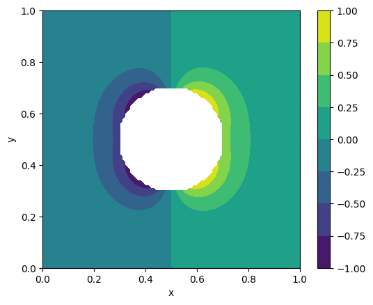
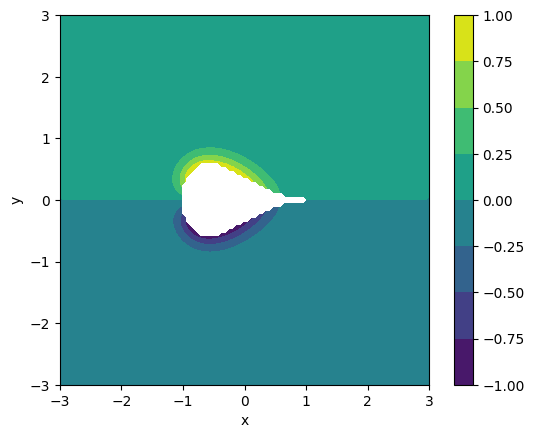
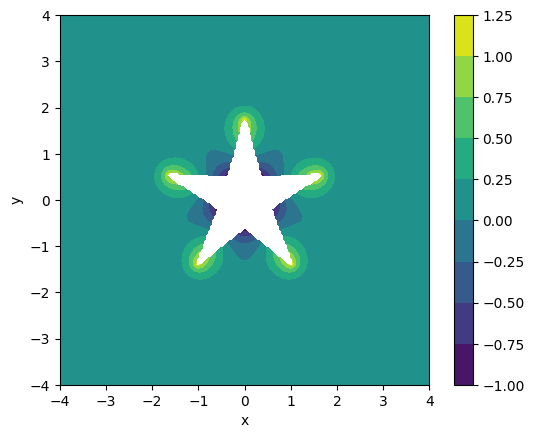

# Elliptic PDE Solver with Irregular Geometry

This is an implementation of a finite difference scheme developed to
solve elliptic PDEs on an irregular grid using a blocking out
approach. This problem is adapted from Chapter 11 of the textbook
"Numerical Partial Differential Equations: Conservation Laws and
Elliptic Equations" by J. W. Thomas.

# Overview

## The Problem

The goal is to solve Laplace's equation

on a domain outide of a circle,

with boundary conditions being

on the surface of the circle, and being 0 on the edges of the domain.

## The Scheme

The problem is solved on a regular grid with a simple, iterative
central difference scheme by blocking out gridpoints contained in the
circle, and applying an alternative, first-order scheme to gridpoints
surrounding the circle. This alternative scheme follows the form of

where `rho = d / delta x`, and `d` is the distance between the
gridpoint and the surface. Note that this scheme is specifically for
the x-axis and approaching the circle from the right. Other schemes
need to be added for the other three directions.

My implementation generalized this scheme to include all four
directions in a single scheme, and I organized it in a way to make use
of vectorized operations as much as possible. This was crucial for
making running the scheme practical, as it can take 10,000-100,000
iterations to converge.

## Results

My code implements this in `solver.py`, which dumps the following image.

## Other Shapes

My implementation defined the circle using parametric equations
(cos(s), sin(s)) for (x,y), with the hopes of generalizing my code to
work shapes defined by other functions. As seen in the following
images, I have successfully run my code on a square, teardrop, and
star. These cases are seen in their respective files, and they are
very easy to implement, only requiring definitions of parametric
functions, boundary conditions, and initial conditions.

# Usage

All code files can be run from the commandline with `python
<filename>`. The code requires installation of NumPy, SciPy, and
MatplotLib.

For testing new shapes, it is best to use the square, teardrop, and
star files as templates. They are all simple examples demonstrating
how to define the parameter functions of the shape and the boundary
conditions and initial conditions.